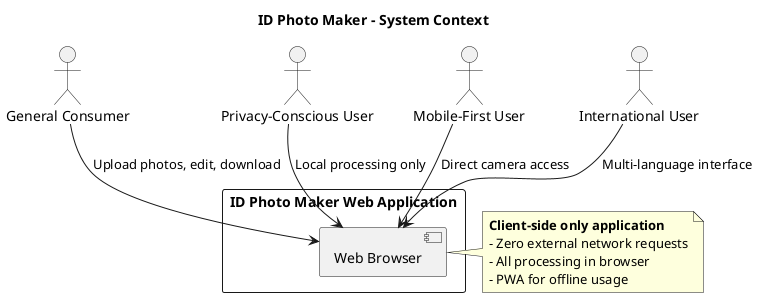
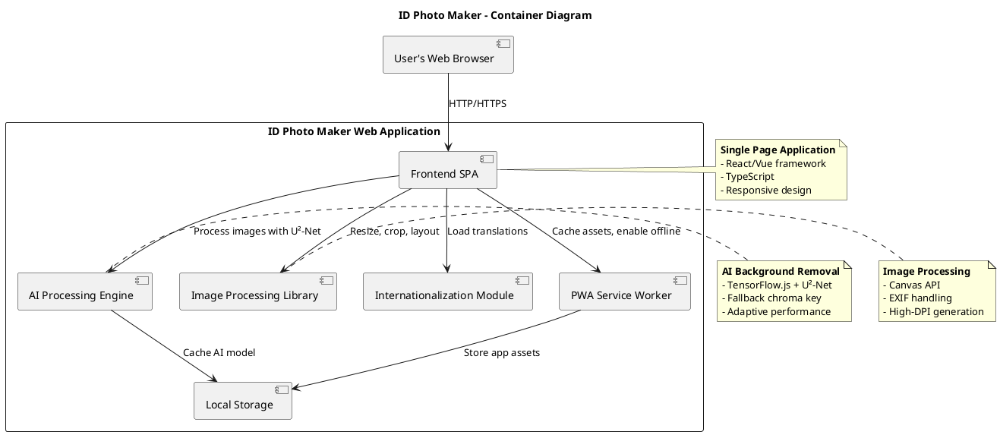
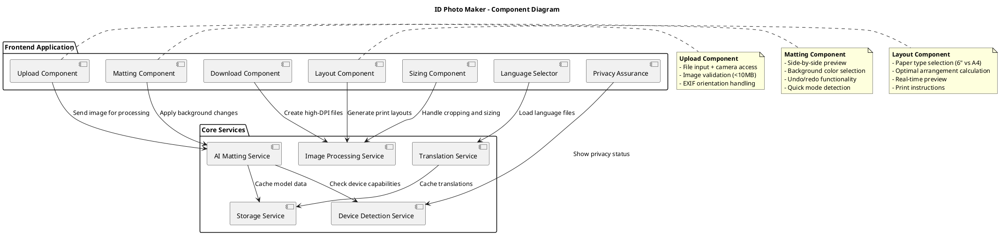
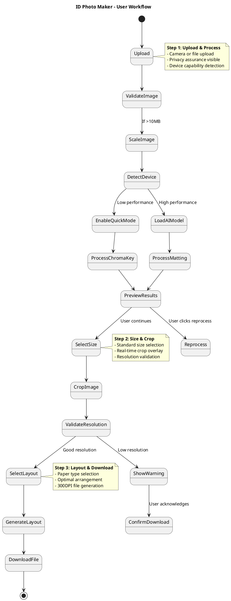
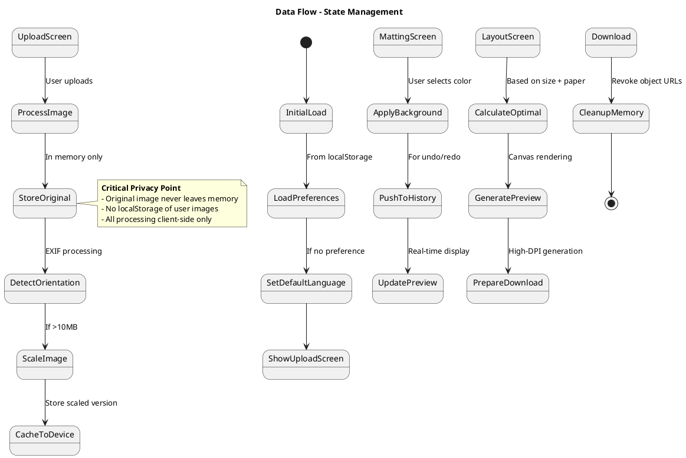
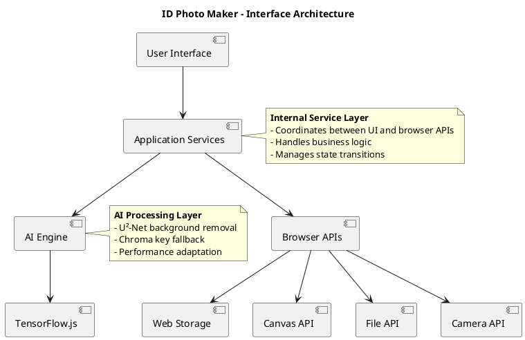
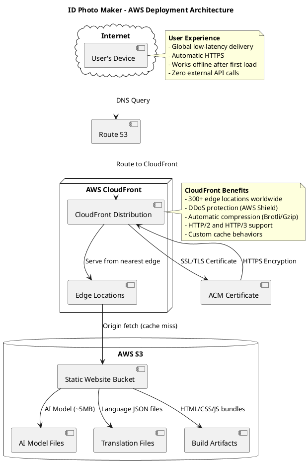

## 1. System Architecture Design

Based on the requirements, this is a privacy-first, client-side web application with zero server dependencies. The architecture needs to support AI-powered background removal, standard sizing, print-ready layouts, internationalization, and offline PWA capabilities.

### Technical Constraints
- **Pure frontend implementation** (no backend required)
- **Tech Stack**: Vite + React + TypeScript for SPA
- **Deployment**: AWS S3 + CloudFront for static hosting
- **AI Model**: U²-Net for portrait segmentation (~5MB WebAssembly/TensorFlow.js)
- **Internationalization**: i18next with offline support for all languages
- **Offline Support**: PWA-enabled with service worker caching (Workbox)

### C4 Context Diagram



### C4 Container Diagram



### C4 Component Diagram



### Component Interaction Flowchart



The architecture follows these key principles:

1. **Zero Server Dependency**: All processing happens in the browser using Web APIs
2. **Progressive Enhancement**: Core functionality works everywhere, enhanced features for capable devices
3. **Privacy by Design**: No external network calls, clear privacy messaging
4. **Mobile-First**: Touch-friendly interfaces, direct camera access
5. **Internationalization Ready**: Complete separation of UI strings from code

**Module Divisions:**
- **Upload Module**: Handles image input, validation, and privacy messaging
- **AI Processing Module**: Manages background removal with adaptive algorithms
- **Sizing Module**: Handles standard dimensions, cropping, and validation
- **Layout Module**: Optimizes print layouts for different paper types
- **Internationalization Module**: Manages translations and cultural formatting
- **PWA Module**: Enables offline functionality and home screen installation

## 2. Technology Stack

Based on the privacy-first, client-side requirements and need for AI-powered image processing, here's my recommended technology stack:

### Core Technologies

**Frontend Framework: Vite + React + TypeScript**
- **Why**: Vite provides blazing fast development and optimized builds, React offers excellent component architecture, TypeScript ensures type safety
- **Performance**: Virtual DOM optimization, efficient re-renders for real-time previews, fast HMR during development
- **Mobile Support**: React Native compatibility if mobile app expansion needed later
- **Bundle Size**: Tree-shaking support to minimize final bundle size

**State Management: Zustand**
- **Why**: Lightweight (1kB), simple API, no boilerplate, perfect for this scale
- **Alternative Considered**: Redux (too heavy), Context API (performance concerns)
- **Benefits**: Easy undo/redo implementation, cross-component state sharing

**AI Processing: TensorFlow.js + U²-Net Model**
- **Why**: Industry-standard for browser-based ML, excellent WebAssembly support
- **Model Variants**: 
  - **U2Net-P (Lite)**: ~4.7MB, faster processing, good quality - default choice
  - **U2Net (Full)**: ~176MB, slower processing, excellent quality - premium option
- **Model Selection**: User-configurable via localStorage with automatic persistence
- **Fallback**: Custom chroma key algorithm for low-performance devices
- **Optimization**: Web Workers for non-blocking processing
- **Implementation**: ONNX Runtime Web for efficient ONNX model execution

**Image Processing: Canvas API + EXIF.js**
- **Why**: Native browser support, no external dependencies
- **EXIF Handling**: exif-js library for orientation correction
- **High-DPI**: Canvas scaling techniques for 300DPI output generation

**Internationalization: i18next**
- **Why**: Mature, feature-rich, excellent React integration
- **Offline Support**: All translation files cached via Service Worker
- **RTL Support**: Built-in right-to-left language handling
- **Format Support**: Date, number, and measurement formatting per locale

**PWA: Workbox + Web App Manifest**
- **Why**: Google's PWA toolkit, reliable caching strategies
- **Caching**: Precache critical assets including AI model
- **Installation**: Automatic prompt after user engagement

### Build Tools & Development

**Bundler: Vite**
- **Why**: Blazing fast development server, optimized production builds
- **Performance**: Native ES modules, minimal configuration
- **TypeScript**: First-class support out of the box

**Testing: Vitest + Playwright**
- **Unit Tests**: Vitest for fast component and utility testing
- **E2E Tests**: Playwright for cross-browser testing including mobile emulation
- **Visual Regression**: Playwright screenshot testing for layout validation

**Code Quality: ESLint + Prettier + Husky**
- **Standards**: TypeScript ESLint rules, accessibility checks
- **Formatting**: Consistent code style with Prettier
- **Git Hooks**: Pre-commit linting and testing

### Performance Optimization Libraries

**Device Detection:**
- Custom detection using `navigator.hardwareConcurrency` and performance APIs
- Fallback to user agent parsing for older browsers

**Memory Management:**
- Object URL cleanup for large image handling
- Canvas context disposal after processing
- Progressive image loading for previews

**Bundle Splitting:**
- Dynamic imports for AI model loading
- Language-specific chunk splitting
- Route-based code splitting for each workflow step

### Justification Summary

| Requirement | Technology Choice | Reasoning |
|-------------|-------------------|-----------|
| Privacy-first | Client-side only | Zero external dependencies, all processing in browser |
| AI Background Removal | TensorFlow.js + U²-Net | Best-in-class browser ML, WebAssembly acceleration |
| Mobile Optimization | React + Vite | Fast loading, touch-friendly components, PWA support |
| Internationalization | i18next | Complete i18n solution with RTL and formatting support |
| Offline Capability | Workbox PWA | Reliable offline caching, including AI model |
| Performance | Web Workers + Canvas | Non-blocking processing, native browser APIs |
| Maintainability | TypeScript + Zustand | Type safety, simple state management, easy testing |

### Bundle Size Considerations

- **Core App**: ~50KB (gzipped) - includes UI, routing, basic functionality
- **AI Model**: ~5MB (cached via Service Worker) - only loaded when needed
- **Translation Files**: ~2KB per language (cached offline)
- **Total Initial Load**: ~100KB (with critical CSS inlined)

The stack prioritizes:
1. **Privacy**: No external services or tracking
2. **Performance**: Optimized for mobile devices and slow connections
3. **Maintainability**: Strong typing, clear architecture, comprehensive testing
4. **Accessibility**: Built-in ARIA support, keyboard navigation
5. **Future-proof**: Modern standards, active communities, long-term support

## 3. Data Model Design

Since this is a client-side application with no server database, the data model focuses on in-memory state management and local storage for caching. All user data (photos) remains in memory and is never persisted.

### Core State Structure

```typescript
// Main application state
interface AppState {
  currentStep: 'upload' | 'matting' | 'sizing' | 'layout' | 'download';
  language: string; // e.g., 'en', 'es', 'fr'
  privacyAcknowledged: boolean;
}

// Upload state
interface UploadState {
  originalImage: HTMLImageElement | null;
  processedImage: HTMLCanvasElement | null;
  fileSize: number; // bytes
  exifOrientation: number;
  isPortrait: boolean;
}

// Matting state
interface MattingState {
  backgroundImage: HTMLCanvasElement | null;
  backgroundColor: string; // hex or rgb()
  customRgb: { r: number; g: number; b: number };
  processingTime: number; // milliseconds
  quickModeEnabled: boolean;
  history: BackgroundState[]; // for undo/redo
  historyIndex: number;
}

interface BackgroundState {
  backgroundColor: string;
  backgroundImage: ImageData | null; // Canvas pixel data for memory efficiency
}

// Sizing state
interface SizingState {
  selectedSize: '1-inch' | '2-inch' | '3-inch';
  cropRect: { x: number; y: number; width: number; height: number };
  faceDetected: boolean;
  resolutionWarning: boolean;
  minResolution: { width: number; height: number };
}

// Layout state
interface LayoutState {
  paperType: '6-inch' | 'a4';
  layoutConfig: LayoutConfig;
  printInstructions: PrintInstruction[];
}

interface LayoutConfig {
  photosPerSheet: number;
  rows: number;
  cols: number;
  photoWidthPx: number;
  photoHeightPx: number;
  marginX: number;
  marginY: number;
  orientation: 'portrait' | 'landscape';
}

interface PrintInstruction {
  platform: 'desktop' | 'ios' | 'android';
  instruction: string;
}
```

### Configuration Data Structures

#### Standard ID Photo Sizes

```typescript
const ID_PHOTO_SIZES = {
  '1-inch': {
    name: '1-inch',
    physical: { width: 25, height: 35 }, // mm
    aspectRatio: 0.714,
    minResolution: { width: 300, height: 420 }, // pixels at 300 DPI
    printableArea: { width: 24, height: 34 } // mm (accounting for bleed)
  },
  '2-inch': {
    name: '2-inch',
    physical: { width: 35, height: 49 }, // mm
    aspectRatio: 0.714,
    minResolution: { width: 420, height: 588 },
    printableArea: { width: 34, height: 48 }
  },
  '3-inch': {
    name: '3-inch',
    physical: { width: 35, height: 52 }, // mm
    aspectRatio: 0.673,
    minResolution: { width: 420, height: 624 },
    printableArea: { width: 34, height: 51 }
  }
} as const;
```

#### Paper Layout Configurations

```typescript
const PAPER_CONFIGS = {
  '6-inch': {
    name: '6-inch photo paper',
    physical: { width: 152, height: 102 }, // mm (6" x 4")
    dpi: 300,
    pixels: { width: 1800, height: 1200 },
    printableMargin: { top: 3, right: 3, bottom: 3, left: 3 } // mm
  },
  'a4': {
    name: 'A4 paper',
    physical: { width: 210, height: 297 }, // mm
    dpi: 300,
    pixels: { width: 2480, height: 3508 },
    printableMargin: { top: 5, right: 5, bottom: 5, left: 5 } // mm
  }
} as const;
```

### Local Storage Schema

For caching and offline functionality, we store non-sensitive configuration data:

```typescript
// localStorage keys and structure
interface CachedData {
  // AI model caching (managed by TensorFlow.js)
  'tfjs-model-u2net': ArrayBuffer;
  
  // User preferences
  'user-preferences': {
    language: string;
    lastUsedSize: string;
    lastUsedPaper: string;
    quickModePreference: boolean;
  };
  
  // Model selection (U2Net variant preference)
  'u2net-model-selection': 'u2netp' | 'u2net'; // User's preferred model variant
  
  // Translation files (cached by Service Worker)
  'translations-en': Record<string, string>;
  'translations-es': Record<string, string>;
  // ... other languages
  
  // App metadata
  'app-version': string;
  'cache-timestamp': number;
}
```

### Memory Management Strategy

To prevent memory leaks with large images:

```typescript
// Image cleanup utility
class ImageManager {
  private objectUrls: string[] = [];
  
  createObjectUrl(file: File): string {
    const url = URL.createObjectURL(file);
    this.objectUrls.push(url);
    return url;
  }
  
  cleanup(): void {
    this.objectUrls.forEach(url => URL.revokeObjectURL(url));
    this.objectUrls = [];
  }
  
  // Called when component unmounts or new image uploaded
}
```

### State Persistence Flow



### Performance Considerations

1. **ImageData vs Canvas**: Use `ImageData` for background history to reduce memory usage
2. **Progressive Loading**: Load high-resolution versions only when needed for download
3. **Web Workers**: Offload AI processing to prevent UI blocking
4. **Canvas Pooling**: Reuse canvas elements instead of creating new ones
5. **Lazy Translation Loading**: Load translation files only when language changes

The data model ensures:
- **Privacy Compliance**: No user data persistence beyond session
- **Memory Efficiency**: Proper cleanup of large image objects
- **Offline Support**: Caching of non-sensitive configuration data
- **Performance**: Optimized data structures for real-time operations
- **Scalability**: Easy addition of new sizes, paper types, and languages

## 4. Interface Specifications

The interface specifications define how components communicate internally and how the application interacts with browser APIs. Since this is a client-side only application, all interfaces are internal or use standard Web APIs.

### API Architecture Overview



### Core Service Interfaces

#### Image Processing Service

```typescript
interface ImageProcessingService {
  // Upload and validation
  validateImage(file: File): ValidationResult;
  scaleImage(image: HTMLImageElement, maxSizeMB: number): Promise<HTMLImageElement>;
  correctOrientation(image: HTMLImageElement, exifOrientation: number): HTMLImageElement;
  
  // Matting operations
  removeBackground(
    image: HTMLImageElement, 
    options: { quickMode?: boolean }
  ): Promise<MattingResult>;
  applyBackgroundColor(
    mattingResult: MattingResult, 
    color: string | RGBColor
  ): HTMLCanvasElement;
  
  // Sizing and cropping
  calculateCropRect(
    imageSize: Size, 
    targetSize: IDPhotoSize
  ): CropRect;
  applyCrop(
    image: HTMLImageElement, 
    cropRect: CropRect
  ): HTMLCanvasElement;
  
  // Layout generation
  calculateOptimalLayout(
    photoSize: IDPhotoSize, 
    paperType: PaperType
  ): LayoutConfig;
  generatePrintLayout(
    croppedImage: HTMLCanvasElement,
    layoutConfig: LayoutConfig,
    paperConfig: PaperConfig
  ): HTMLCanvasElement;
  
  // High-DPI export
  createHighDPIImage(
    canvas: HTMLCanvasElement,
    dpi: number,
    format: 'png' | 'pdf'
  ): Promise<Blob>;
}

interface ValidationResult {
  isValid: boolean;
  fileSize: number;
  dimensions: { width: number; height: number };
  warnings: string[];
}

interface MattingResult {
  foregroundMask: ImageData;
  processedImage: HTMLCanvasElement;
  processingTime: number;
  quality: 'high' | 'medium' | 'low';
}
```

#### AI Matting Service

```typescript
interface AIMattingService {
  // Model management
  loadModel(): Promise<void>;
  isModelLoaded(): boolean;
  getModelSize(): number;
  
  // Background removal
  processWithU2Net(image: HTMLImageElement): Promise<MattingResult>;
  processWithChromaKey(image: HTMLImageElement): Promise<MattingResult>;
  
  // Performance detection
  detectDeviceCapability(): DeviceCapability;
  shouldUseQuickMode(): boolean;
  
  // Memory management
  cleanup(): void;
}

interface DeviceCapability {
  hardwareConcurrency: number;
  memoryEstimate: number; // GB
  supportsWebAssembly: boolean;
  performanceClass: 'high' | 'medium' | 'low';
}
```

#### Internationalization Service

```typescript
interface I18nService {
  // Language management
  getAvailableLanguages(): LanguageInfo[];
  setCurrentLanguage(langCode: string): void;
  getCurrentLanguage(): string;
  
  // Translation
  t(key: string, params?: Record<string, any>): string;
  translate(key: string, params?: Record<string, any>): string;
  
  // Formatting
  formatNumber(value: number, locale?: string): string;
  formatMeasurement(mm: number, locale?: string): string;
  isRTL(language: string): boolean;
  
  // Loading
  loadLanguage(langCode: string): Promise<void>;
  isLanguageLoaded(langCode: string): boolean;
}

interface LanguageInfo {
  code: string;
  name: string; // Native name (e.g., "Español")
  englishName: string; // English name (e.g., "Spanish")
  rtl: boolean;
}
```

### Browser API Wrappers

#### Camera and File Access

```typescript
interface MediaService {
  // Camera access
  requestCameraPermission(): Promise<boolean>;
  capturePhoto(): Promise<File>;
  hasCameraSupport(): boolean;
  
  // File handling
  readFileAsImage(file: File): Promise<HTMLImageElement>;
  downloadFile(blob: Blob, filename: string): void;
  getMimeType(file: File): string;
}

// Usage example:
// const mediaService = new MediaService();
// if (mediaService.hasCameraSupport()) {
//   const photo = await mediaService.capturePhoto();
//   const image = await mediaService.readFileAsImage(photo);
// }
```

#### Storage and Caching

```typescript
interface StorageService {
  // Local storage
  setItem(key: string, value: any): void;
  getItem<T>(key: string): T | null;
  removeItem(key: string): void;
  
  // Session storage (for temporary data)
  setSessionItem(key: string, value: any): void;
  getSessionItem<T>(key: string): T | null;
  
  // Cache management
  clearCache(): void;
  getCacheSize(): number;
  isStorageAvailable(): boolean;
}
```

### Component Communication Patterns

#### State Management with Zustand

```typescript
// Store definition
interface AppStore extends AppState, UploadState, MattingState, SizingState, LayoutState {
  // Actions
  setLanguage: (lang: string) => void;
  uploadImage: (file: File) => Promise<void>;
  processMatting: () => Promise<void>;
  undoBackground: () => void;
  redoBackground: () => void;
  selectSize: (size: IDPhotoSize) => void;
  updateCrop: (cropRect: CropRect) => void;
  selectPaper: (paper: PaperType) => void;
  downloadImage: (format: 'png' | 'pdf') => Promise<void>;
}

// Hook usage in components
const useAppStore = create<AppStore>((set, get) => ({
  currentStep: 'upload',
  language: 'en',
  // ... initial state
  
  setLanguage: (lang) => {
    i18nService.setCurrentLanguage(lang);
    set({ language: lang });
  },
  
  uploadImage: async (file) => {
    const validation = imageProcessingService.validateImage(file);
    if (!validation.isValid) {
      // Handle validation error
      return;
    }
    
    const image = await mediaService.readFileAsImage(file);
    const processed = imageProcessingService.correctOrientation(image, validation.exifOrientation);
    
    set({
      originalImage: processed,
      currentStep: 'matting'
    });
  }
}));
```

#### Event-Driven Communication

For real-time updates and non-blocking operations:

```typescript
// Custom events for cross-component communication
interface AppEvents {
  'matting:complete': { result: MattingResult };
  'matting:error': { error: Error };
  'layout:generated': { canvas: HTMLCanvasElement };
  'language:changed': { language: string };
  'privacy:acknowledged': void;
}

// Event emitter implementation
class EventEmitter {
  private events: Map<string, Function[]> = new Map();
  
  on<T extends keyof AppEvents>(event: T, listener: (data: AppEvents[T]) => void): void {
    if (!this.events.has(event)) {
      this.events.set(event, []);
    }
    this.events.get(event)!.push(listener);
  }
  
  emit<T extends keyof AppEvents>(event: T, data: AppEvents[T]): void {
    const listeners = this.events.get(event);
    if (listeners) {
      listeners.forEach(listener => listener(data));
    }
  }
}
```

### Error Handling and Validation

#### Standard Error Interface

```typescript
interface AppError {
  code: string;
  message: string;
  details?: any;
  recoveryOptions?: RecoveryOption[];
}

interface RecoveryOption {
  label: string;
  action: () => void;
  severity: 'info' | 'warning' | 'error';
}

// Error codes
enum ErrorCode {
  IMAGE_TOO_LARGE = 'IMAGE_TOO_LARGE',
  UNSUPPORTED_FORMAT = 'UNSUPPORTED_FORMAT',
  MEMORY_LIMIT_EXCEEDED = 'MEMORY_LIMIT_EXCEEDED',
  CAMERA_ACCESS_DENIED = 'CAMERA_ACCESS_DENIED',
  AI_PROCESSING_FAILED = 'AI_PROCESSING_FAILED',
  LOW_RESOLUTION_WARNING = 'LOW_RESOLUTION_WARNING'
}
```

#### Input Validation Schema

```typescript
// RGB color validation
interface RGBValidation {
  isValid: boolean;
  normalized: { r: number; g: number; b: number };
  errorMessage?: string;
}

function validateRGB(input: { r: any; g: any; b: any }): RGBValidation {
  const result = { r: 0, g: 0, b: 0 };
  const errors: string[] = [];
  
  ['r', 'g', 'b'].forEach(channel => {
    const value = parseInt(input[channel as keyof typeof input]);
    if (isNaN(value) || value < 0 || value > 255) {
      errors.push(`${channel.toUpperCase()} must be between 0-255`);
    } else {
      result[channel as keyof typeof result] = value;
    }
  });
  
  return {
    isValid: errors.length === 0,
    normalized: result,
    errorMessage: errors.join(', ')
  };
}
```

### Security and Privacy Interfaces

```typescript
interface PrivacyService {
  // Privacy assurance
  getPrivacyStatement(): string;
  verifyNoExternalRequests(): boolean;
  
  // Data handling
  ensureImageDataIsLocalOnly(): void;
  clearAllUserData(): void;
  
  // Compliance
  getPrivacyPolicyUrl(): string;
  showPrivacyNotice(): void;
}

// Network monitoring (for development/debugging)
class NetworkMonitor {
  static monitorRequests(): void {
    if (process.env.NODE_ENV === 'development') {
      const originalFetch = window.fetch;
      window.fetch = (...args) => {
        console.warn('External network request detected:', args[0]);
        return originalFetch(...args);
      };
    }
  }
}
```

The interface design ensures:
- **Clear Separation**: Each service has a single responsibility
- **Type Safety**: Comprehensive TypeScript interfaces
- **Privacy Compliance**: No external API calls, local-only data handling
- **Error Resilience**: Comprehensive error handling with recovery options
- **Extensibility**: Easy to add new features without breaking existing code

## 5. Deployment Architecture 

Using AWS S3 + CloudFront provides excellent control, global performance, and cost efficiency for static sites. Here's the updated deployment architecture:

### AWS Infrastructure Topology



### CI/CD Pipeline with GitHub Actions + AWS

```yaml
# .github/workflows/deploy-aws.yml
name: Deploy to AWS S3 + CloudFront

on:
  push:
    branches: [main]
  pull_request:
    branches: [main]

env:
  AWS_REGION: us-east-1
  S3_BUCKET: id-photo-maker-prod
  CLOUDFRONT_DISTRIBUTION_ID: E123456789ABC

jobs:
  test:
    runs-on: ubuntu-latest
    steps:
      - uses: actions/checkout@v3
      - name: Setup Node.js
        uses: actions/setup-node@v3
        with:
          node-version: '18'
      - name: Install dependencies
        run: npm ci
      - name: Run tests
        run: npm test
      - name: Build
        run: npm run build
      - name: Upload build artifacts
        uses: actions/upload-artifact@v3
        with:
          name: build-files
          path: dist/

  deploy-preview:
    if: github.event_name == 'pull_request'
    needs: test
    runs-on: ubuntu-latest
    steps:
      - uses: actions/checkout@v3
      - name: Download build artifacts
        uses: actions/download-artifact@v3
        with:
          name: build-files
          path: dist/
      - name: Configure AWS credentials
        uses: aws-actions/configure-aws-credentials@v2
        with:
          aws-access-key-id: ${{ secrets.AWS_ACCESS_KEY_ID }}
          aws-secret-access-key: ${{ secrets.AWS_SECRET_ACCESS_KEY }}
          aws-region: ${{ env.AWS_REGION }}
      - name: Deploy to S3 preview bucket
        run: |
          aws s3 sync dist/ s3://id-photo-maker-preview-${{ github.head_ref }} --delete
      - name: Invalidate CloudFront preview
        run: |
          aws cloudfront create-invalidation --distribution-id ${{ secrets.CLOUDFRONT_PREVIEW_ID }} --paths "/*"

  deploy-production:
    if: github.event_name == 'push' && github.ref == 'refs/heads/main'
    needs: test
    runs-on: ubuntu-latest
    steps:
      - uses: actions/checkout@v3
      - name: Download build artifacts
        uses: actions/download-artifact@v3
        with:
          name: build-files
          path: dist/
      - name: Configure AWS credentials
        uses: aws-actions/configure-aws-credentials@v2
        with:
          aws-access-key-id: ${{ secrets.AWS_ACCESS_KEY_ID }}
          aws-secret-access-key: ${{ secrets.AWS_SECRET_ACCESS_KEY }}
          aws-region: ${{ env.AWS_REGION }}
      - name: Deploy to S3 production
        run: |
          aws s3 sync dist/ s3://${{ env.S3_BUCKET }} --delete --cache-control "max-age=31536000,immutable"
      - name: Invalidate CloudFront cache
        run: |
          aws cloudfront create-invalidation --distribution-id ${{ env.CLOUDFRONT_DISTRIBUTION_ID }} --paths "/*"
```

### Security Configuration

**S3 Security:**
- Block Public ACLs enabled
- Server-side encryption with AES-256
- Versioning enabled for rollback capability
- Bucket policy restricted to CloudFront OAI only

**CloudFront Security:**
- HTTPS redirect enforced
- TLS 1.2+ minimum protocol
- HTTP/2 and HTTP/3 support
- DDoS protection via AWS Shield (included)
- Custom security headers via Lambda@Edge (optional)

**Security Headers via Lambda@Edge:**
```javascript
// lambda-edge-security-headers.js
exports.handler = (event, context, callback) => {
  const response = event.Records[0].cf.response;
  const headers = response.headers;

  headers['strict-transport-security'] = [{ key: 'Strict-Transport-Security', value: 'max-age=63072000; includeSubDomains; preload' }];
  headers['content-security-policy'] = [{ key: 'Content-Security-Policy', value: "default-src 'self'; script-src 'self' 'unsafe-inline'; style-src 'self' 'unsafe-inline'; img-src 'self' data:; connect-src 'none';" }];
  headers['x-content-type-options'] = [{ key: 'X-Content-Type-Options', value: 'nosniff' }];
  headers['x-frame-options'] = [{ key: 'X-Frame-Options', value: 'DENY' }];
  headers['referrer-policy'] = [{ key: 'Referrer-Policy', value: 'no-referrer' }];
  headers['permissions-policy'] = [{ key: 'Permissions-Policy', value: 'camera=(), microphone=()' }];

  callback(null, response);
};
```

### Cost Optimization

**Estimated Monthly Costs:**
- **S3 Storage**: ~$0.23/month (1GB storage)
- **CloudFront**: ~$0.085/GB data transfer + $0.0075 per 10,000 requests
- **Route 53**: ~$0.50/month (hosted zone + records)
- **ACM Certificate**: Free
- **Total**: ~$1-5/month for typical usage

**Cost Optimization Strategies:**
- Long TTL caching reduces origin requests
- Brotli compression reduces data transfer costs
- Price Class 100 limits to most cost-effective regions
- No compute costs (pure static hosting)

### Monitoring and Logging

**CloudWatch Metrics:**
- CloudFront request counts and data transfer
- S3 request metrics (if enabled)
- Error rate monitoring

**Custom Monitoring:**
- Synthetic checks using AWS CloudWatch Synthetics
- Real User Monitoring (RUM) via AWS RUM (optional, privacy-conscious)
- Web Vitals tracking in application code

This AWS-focused deployment architecture provides:
- **Enterprise-grade reliability**: AWS global infrastructure
- **Cost efficiency**: Pay only for what you use
- **Security**: Comprehensive security configuration
- **Performance**: Global CDN with HTTP/3 support
- **Privacy compliance**: Zero external dependencies
- **Infrastructure as Code**: Full reproducibility and version control

## 6. Repository Structure

Here's an organized, maintainable repository structure that follows best practices for the ID Photo Maker application:

### Directory Tree

```
id-photo-maker/
├── .github/
│   └── workflows/
│       ├── deploy-aws.yml          # AWS deployment pipeline
│       └── test.yml                # Testing pipeline
├── docs/
│   ├── architecture/               # Architecture documentation
│   │   ├── system-architecture.md
│   │   ├── technology-stack.md
│   │   ├── data-model.md
│   │   ├── interface-specs.md
│   │   ├── deployment-architecture.md
│   │   └── diagrams/               # PlantUML and other diagrams
│   ├── api-specs/                  # Detailed API documentation
│   ├── deployment-guides/          # AWS deployment instructions
│   └── user-guides/                # End-user documentation
├── public/
│   ├── icons/                      # App icons for PWA
│   │   ├── icon-192x192.png
│   │   └── icon-512x512.png
│   ├── locales/                    # Translation files (fallback)
│   │   ├── en.json
│   │   ├── es.json
│   │   ├── fr.json
│   │   └── ...                     # Other languages
│   ├── ai-models/                  # AI model files (if not CDN-hosted)
│   │   └── u2net/
│   ├── manifest.json               # Web App Manifest
│   ├── robots.txt
│   └── favicon.ico
├── src/
│   ├── assets/                     # Static assets
│   │   ├── images/                 # UI images (logos, illustrations)
│   │   └── styles/                 # Global styles
│   │       ├── main.css
│   │       └── variables.css
│   ├── components/                 # Reusable UI components
│   │   ├── common/                 # Generic components
│   │   │   ├── Button.tsx
│   │   │   ├── Card.tsx
│   │   │   └── Modal.tsx
│   │   ├── upload/                 # Upload step components
│   │   │   ├── UploadScreen.tsx
│   │   │   ├── CameraButton.tsx
│   │   │   └── FileInput.tsx
│   │   ├── matting/                # Matting step components
│   │   │   ├── MattingScreen.tsx
│   │   │   ├── BackgroundSelector.tsx
│   │   │   ├── PreviewPanel.tsx
│   │   │   └── UndoRedoControls.tsx
│   │   ├── sizing/                 # Sizing step components
│   │   │   ├── SizingScreen.tsx
│   │   │   ├── SizeSelector.tsx
│   │   │   └── CropOverlay.tsx
│   │   ├── layout/                 # Layout step components
│   │   │   ├── LayoutScreen.tsx
│   │   │   ├── PaperSelector.tsx
│   │   │   └── LayoutPreview.tsx
│   │   └── download/               # Download step components
│   │       ├── DownloadScreen.tsx
│   │       └── PrintInstructions.tsx
│   ├── hooks/                      # Custom React hooks
│   │   ├── useDeviceDetection.ts
│   │   ├── useImageProcessing.ts
│   │   ├── useAIMatting.ts
│   │   ├── useInternationalization.ts
│   │   └── usePrivacyAssurance.ts
│   ├── lib/                        # Core libraries and utilities
│   │   ├── ai/                     # AI processing logic
│   │   │   ├── U2NetProcessor.ts
│   │   │   ├── ChromaKeyProcessor.ts
│   │   │   └── DeviceCapabilityDetector.ts
│   │   ├── image/                  # Image processing utilities
│   │   │   ├── ImageValidator.ts
│   │   │   ├── EXIFHandler.ts
│   │   │   ├── CanvasUtils.ts
│   │   │   └── HighDPIGenerator.ts
│   │   ├── i18n/                   # Internationalization utilities
│   │   │   ├── TranslationManager.ts
│   │   │   ├── RTLHelper.ts
│   │   │   └── FormatHelper.ts
│   │   ├── privacy/                # Privacy utilities
│   │   │   ├── PrivacyService.ts
│   │   │   └── NetworkMonitor.ts
│   │   └── utils/                  # General utilities
│   │       ├── validation.ts
│   │       ├── memory.ts
│   │       └── storage.ts
│   ├── services/                   # Application services
│   │   ├── ImageProcessingService.ts
│   │   ├── AIMattingService.ts
│   │   ├── I18nService.ts
│   │   ├── MediaService.ts
│   │   └── StorageService.ts
│   ├── store/                      # State management
│   │   ├── appStore.ts             # Main Zustand store
│   │   └── types.ts                # Store types and interfaces
│   ├── types/                      # TypeScript type definitions
│   │   ├── index.ts
│   │   ├── app.ts
│   │   ├── image.ts
│   │   ├── ai.ts
│   │   └── i18n.ts
│   ├── views/                      # Main application views
│   │   ├── App.tsx                 # Root component
│   │   ├── UploadView.tsx
│   │   ├── MattingView.tsx
│   │   ├── SizingView.tsx
│   │   ├── LayoutView.tsx
│   │   └── DownloadView.tsx
│   ├── workers/                    # Web Workers
│   │   └── aiProcessor.worker.ts
│   ├── config/                     # Configuration files
│   │   ├── constants.ts            # App constants
│   │   ├── sizes.ts                # ID photo size configurations
│   │   ├── paper.ts                # Paper layout configurations
│   │   └── languages.ts            # Language configurations
│   ├── sw/                         # Service Worker
│   │   └── sw.ts
│   └── main.tsx                    # Application entry point
├── tests/
│   ├── unit/                       # Unit tests
│   │   ├── lib/
│   │   ├── services/
│   │   └── hooks/
│   ├── integration/                # Integration tests
│   │   └── workflow/
│   └── e2e/                        # End-to-end tests
│       ├── upload.spec.ts
│       ├── matting.spec.ts
│       ├── sizing.spec.ts
│       └── layout.spec.ts
├── terraform/                      # Infrastructure as Code
│   ├── main.tf
│   ├── variables.tf
│   ├── outputs.tf
│   └── README.md
├── .dockerignore                   # Docker ignore (optional)
├── .gitignore
├── .eslintrc.js
├── .prettierrc
├── package.json
├── tsconfig.json
├── vite.config.ts
├── README.md
└── LICENSE
```

### Key Directory Explanations

#### **docs/** - Comprehensive Documentation
- Contains all architecture documentation in Markdown format
- Includes generated diagrams from PlantUML sources
- Separated into logical sections for easy navigation
- Deployment guides specific to AWS infrastructure

#### **public/** - Static Assets and Public Files
- **locales/**: Translation files available at build time
- **ai-models/**: AI model files (can be moved to CDN if preferred)
- **icons/**: PWA icons in multiple sizes
- All files served directly without processing

#### **src/components/** - Component Organization
- Organized by feature/workflow step rather than generic categories
- Each step has its own subdirectory with related components
- Promotes feature-based development and easier maintenance

#### **src/lib/** - Core Business Logic
- **ai/**: All AI-related processing logic isolated here
- **image/**: Pure image processing utilities without framework dependencies
- **i18n/**: Internationalization utilities separate from UI
- **privacy/**: Privacy-focused utilities and monitoring

#### **src/services/** - Application Services
- Clean separation between UI components and business logic
- Each service handles a specific domain responsibility
- Easy to mock for testing and maintain single responsibility

#### **src/store/** - State Management
- Single Zustand store with clear action definitions
- Types separated for better TypeScript support
- Centralized state management following Redux-like patterns

#### **src/workers/** - Web Workers
- Isolated AI processing in Web Workers to prevent UI blocking
- Separate from main thread logic for performance

#### **src/sw/** - Service Worker
- Dedicated service worker implementation
- Workbox integration for caching strategies

#### **terraform/** - Infrastructure as Code
- Complete AWS infrastructure definition
- Version-controlled infrastructure configuration
- Reproducible deployments across environments

#### **tests/** - Comprehensive Testing
- **unit/**: Fast, isolated unit tests for utilities and services
- **integration/**: Tests for component interactions and workflows
- **e2e/**: Real browser tests using Playwright for critical user journeys

### Build and Deployment Scripts

**package.json scripts:**
```json
{
  "scripts": {
    "dev": "vite",
    "build": "tsc && vite build",
    "preview": "vite preview",
    "test": "vitest",
    "test:e2e": "playwright test",
    "lint": "eslint . --ext ts,tsx --report-unused-disable-directives --max-warnings 0",
    "format": "prettier --write .",
    "deploy:aws": "npm run build && aws s3 sync dist/ s3://id-photo-maker-prod --delete",
    "invalidate:cloudfront": "aws cloudfront create-invalidation --distribution-id YOUR_DISTRIBUTION_ID --paths '/*'",
    "terraform:plan": "cd terraform && terraform plan",
    "terraform:apply": "cd terraform && terraform apply"
  }
}
```

### Configuration Files

**vite.config.ts - Build Configuration:**
```typescript
import { defineConfig } from 'vite';
import react from '@vitejs/plugin-react';
import { resolve } from 'path';

export default defineConfig({
  plugins: [react()],
  build: {
    rollupOptions: {
      output: {
        manualChunks: {
          // Split AI model into separate chunk
          'ai-model': ['@tensorflow/tfjs', './src/lib/ai/U2NetProcessor.ts'],
          // Split translations by language
          'translations': ['./src/lib/i18n/TranslationManager.ts'],
          // Split vendor dependencies
          'vendor': ['react', 'react-dom', 'zustand', 'i18next']
        }
      }
    }
  },
  resolve: {
    alias: {
      '@': resolve(__dirname, 'src'),
      '@components': resolve(__dirname, 'src/components'),
      '@lib': resolve(__dirname, 'src/lib'),
      '@services': resolve(__dirname, 'src/services')
    }
  }
});
```

**tsconfig.json - TypeScript Configuration:**
```json
{
  "compilerOptions": {
    "target": "ES2020",
    "useDefineForClassFields": true,
    "lib": ["ES2020", "DOM", "DOM.Iterable"],
    "module": "ESNext",
    "skipLibCheck": true,
    "baseUrl": ".",
    "paths": {
      "@/*": ["src/*"],
      "@components/*": ["src/components/*"],
      "@lib/*": ["src/lib/*"],
      "@services/*": ["src/services/*"]
    },
    "esModuleInterop": false,
    "allowSyntheticDefaultImports": true,
    "strict": true,
    "forceConsistentCasingInFileNames": true,
    "moduleResolution": "node",
    "resolveJsonModule": true,
    "isolatedModules": true,
    "noEmit": true,
    "jsx": "react-jsx"
  },
  "include": ["src", "tests", "vite.config.ts"],
  "references": [{ "path": "./tsconfig.node.json" }]
}
```

This repository structure provides:

1. **Clear Separation of Concerns**: Each directory has a specific purpose
2. **Scalability**: Easy to add new features, languages, or size configurations
3. **Maintainability**: Consistent naming and organization patterns
4. **Testing Support**: Comprehensive test organization
5. **Deployment Ready**: Includes all necessary configuration files
6. **Documentation First**: Architecture docs alongside code
7. **Type Safety**: Comprehensive TypeScript configuration
8. **Performance Optimized**: Proper code splitting and chunking

## 9. Implemented Components

### Background Selector Component

**Location**: `src/components/background/BackgroundSelector.tsx`

**Purpose**: Allows users to select preset background colors (Red, Blue, White) or enter custom RGB values to meet specific ID photo requirements.

**Key Features**:
- **Preset Colors**: Three buttons for immediate selection (#FF0000, #0000FF, #FFFFFF)
- **Real-time Preview**: Visual feedback showing the currently selected background color
- **Custom RGB Input**: Three number inputs for Red, Green, and Blue channels (0-255)
- **Validation**: Real-time validation with error messages for invalid inputs
- **Accessibility**: Proper ARIA labels and keyboard navigation support

**Component Structure**:
```typescript
interface BackgroundSelectorProps {
  onColorChange: (color: string) => void  // Callback with hex color
  initialColor?: string                    // Default: #FFFFFF
}
```

**Internal Implementation**:
- **State Management**: Uses React hooks for local state (selectedColor, rgbValues, errors)
- **Color Conversion**: Helper functions for hex ↔ RGB conversion
- **Validation Logic**: Validates RGB values are within 0-255 range
- **Error Handling**: Shows error messages for invalid inputs, prevents invalid color application

**Testing**: Comprehensive test coverage (18 tests) in `BackgroundSelector.test.tsx`
- Preset color selection tests
- Custom RGB input tests
- Validation and error message tests
- Real-time preview tests
- Boundary value tests (0 and 255)

**Related User Story**: Epic 1, User Story 2 - "As a General Consumer, I want to select preset background colors or custom RGB"

**Future Enhancements**:
- Color picker UI for advanced users
- Recent colors history
- Color palette suggestions based on ID requirements

---

### 3. MattingPreview Component

**Location**: `src/components/preview/MattingPreview.tsx`

**Purpose**: Displays original and processed images side-by-side for quality verification, allowing users to reprocess or continue to the next step.

**Key Features**:
- **Side-by-Side Comparison**: Displays original and processed images in a grid layout
- **Action Buttons**: "Reprocess" to restart workflow, "Continue" to proceed
- **Accessibility**: Proper ARIA labels and semantic HTML
- **Responsive Design**: Works on mobile and desktop with Tailwind CSS

**Props Interface**:
```typescript
interface MattingPreviewProps {
  originalImage: string         // URL or data URL of original image
  processedImage: string        // URL or data URL of processed image
  onReprocess: () => void       // Callback to restart workflow
  onContinue: () => void        // Callback to continue to next step
}
```

**Component Structure**:
- **Header**: "Preview Results" title
- **Image Grid**: Two-column layout (original left, processed right)
- **Image Labels**: "Original" and "Processed" headings
- **Action Bar**: Centered buttons for reprocess and continue

**Testing**: Comprehensive test coverage (7 tests) in `MattingPreview.test.tsx`
- Side-by-side image display tests
- Image labels and accessibility tests
- Reprocess button functionality tests
- Continue button functionality tests

**Related User Story**: Epic 1, User Story 3 - "As a General Consumer, I want to preview matting results and choose to reprocess or continue"

**Future Enhancements**:
- Zoom functionality for detailed inspection
- Before/after slider for comparison
- Quality metrics display
- Save draft functionality

---

### 4. App Workflow Integration

**Location**: `src/App.tsx`

**Purpose**: Orchestrates the main application workflow, managing state transitions between upload, background selection, preview, and size selection steps.

**Workflow Steps**:
1. **Upload**: User uploads and processes image (ImageUpload component)
2. **Background**: User selects background color (BackgroundSelector component)
3. **Preview**: User reviews matting results (MattingPreview component)
4. **Size Selection**: User selects photo dimensions (placeholder - to be implemented)

**State Management**:
```typescript
type WorkflowStep = 'upload' | 'background' | 'preview' | 'size-selection'

interface ImageData {
  originalFile: File      // Original uploaded file
  originalUrl: string     // Object URL for display
  processedBlob: Blob     // Processed image blob
  processedUrl: string    // Object URL for display
}
```

**Key Features**:
- **Step Indicator**: Visual progress bar showing current step (1-4)
- **State Management**: React useState for workflow and image data
- **URL Management**: Creates and cleans up object URLs to prevent memory leaks
- **Callback Propagation**: Passes callbacks down to child components
- **Conditional Rendering**: Displays appropriate component based on current step

**Component Integration**:
- `ImageUpload`: Accepts `onImageProcessed` callback to transition to background step
- `BackgroundSelector`: Manages color selection, integrated with continue button
- `MattingPreview`: Displays images and provides reprocess/continue actions

**Testing**: Comprehensive integration tests (6 tests) in `App.test.tsx`
- Initial upload screen display
- Transition to background selector after upload
- Transition to preview after background selection
- Reprocess button returns to upload
- Continue button proceeds to size selection

**Related User Stories**:
- Epic 1, User Story 1 - Upload and matting functionality
- Epic 1, User Story 2 - Background color selection
- Epic 1, User Story 3 - Preview and quality control

**Future Enhancements**:
- Persistent state with localStorage
- Back button navigation
- Skip background selection option
- Multiple image workflow

---

## Implementation Progress Summary

**Completed Components**:
- ✅ ImageUpload - Epic 1, User Story 1
- ✅ BackgroundSelector - Epic 1, User Story 2
- ✅ MattingPreview - Epic 1, User Story 3
- ✅ App Workflow - Integrated workflow management

**Test Coverage**: 79 tests passing
- All components have comprehensive unit tests
- Integration tests verify workflow transitions
- No linting errors

**Next Steps**:
- Implement size selection component (Epic 2, User Story 1)
- Add print layout system (Epic 3)
- Implement PWA capabilities (Epic 4)
- Add internationalization (Epic 5)
